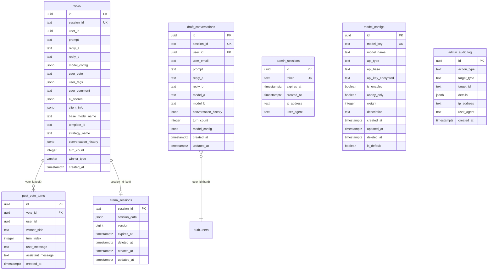
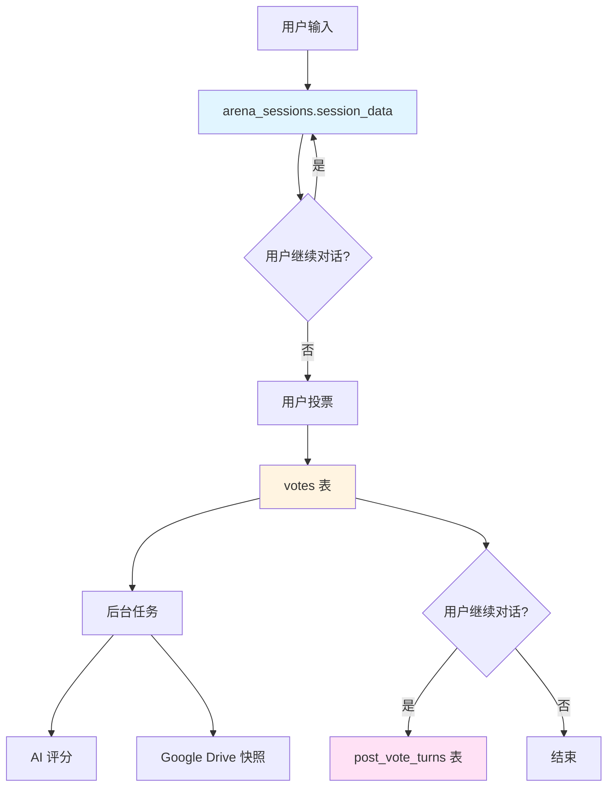
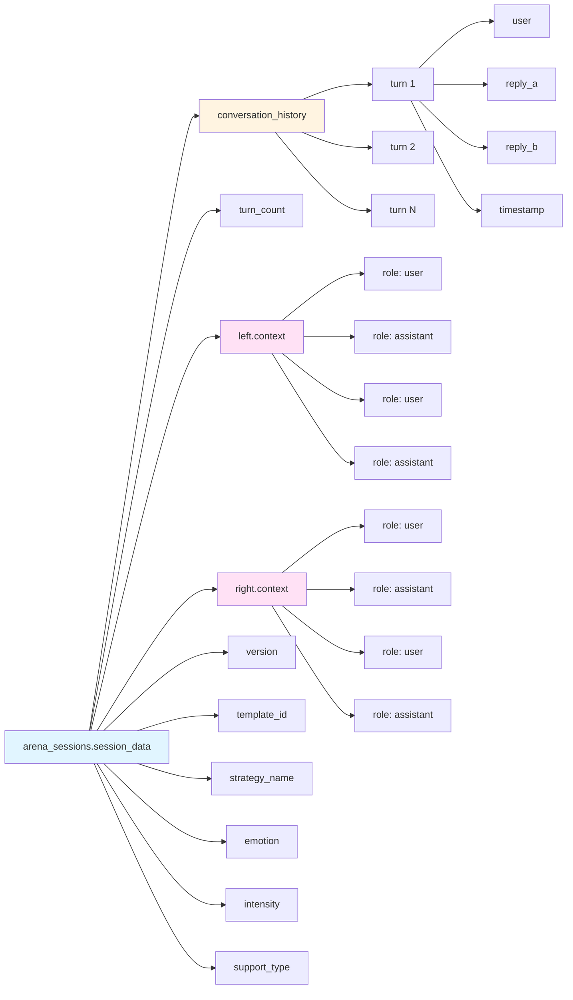
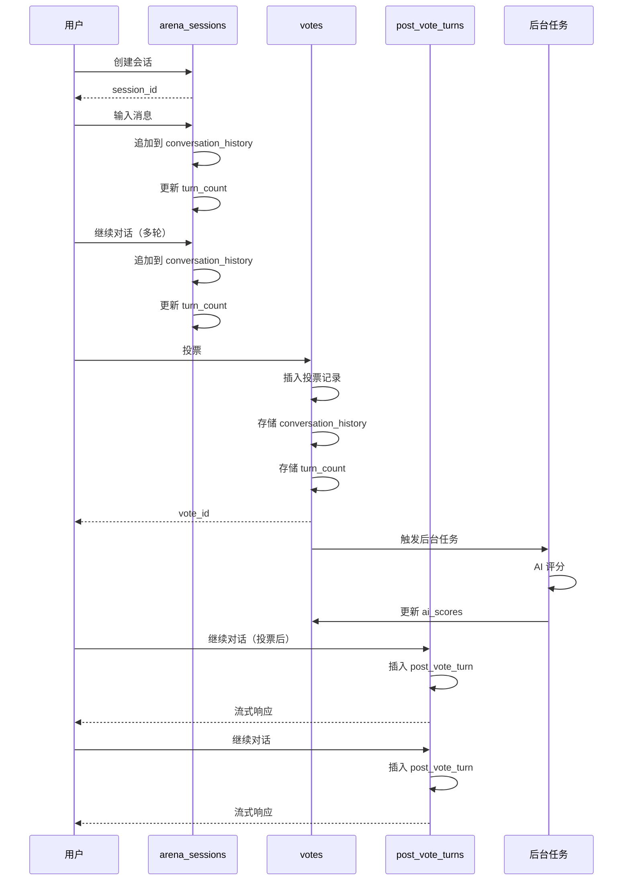
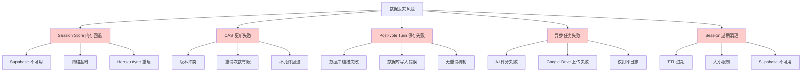
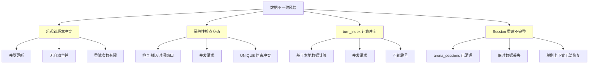
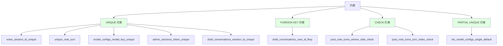
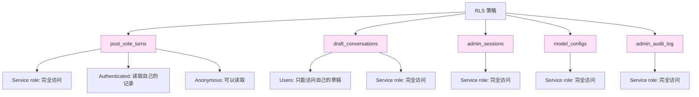

# eChat Arena 数据库 Schema 可视化图

## 1. 完整 ER 图



## 2. 数据流图



## 3. Session 数据结构图



## 4. 投票流程图



## 5. 数据丢失风险图



## 6. 数据不一致风险图



## 7. 索引结构图

```mermaid
graph TD
    A[votes 表索引] --> A1[idx_votes_session_id]
    A --> A2[idx_votes_turn_count]
    A --> A3[idx_votes_conversation_history_gin]
    A --> A4[idx_votes_user_turn]
    A --> A5[idx_votes_created_at]
    A --> A6[idx_votes_winner_type]

    B[post_vote_turns 表索引] --> B1[idx_post_vote_turns_vote_id_turn]
    B --> B2[idx_post_vote_turns_vote_id_created]
    B --> B3[idx_post_vote_turns_user_id]

    C[arena_sessions 表索引] --> C1[idx_arena_sessions_expires_at]
    C --> C2[idx_arena_sessions_deleted_at]

    D[draft_conversations 表索引] --> D1[idx_draft_user_id]
    D --> D2[idx_draft_session_id]

    E[admin_sessions 表索引] --> E1[idx_admin_sessions_token]
    E --> E2[idx_admin_sessions_expires_at]

    F[model_configs 表索引] --> F1[idx_model_configs_model_key]
    F --> F2[idx_model_configs_is_enabled]
    F --> F3[idx_model_configs_deleted_at]
    F --> F4[idx_model_configs_single_default]

    G[admin_audit_log 表索引] --> G1[idx_admin_audit_log_action]
    G --> G2[idx_admin_audit_log_created]

    style A fill:#e1f5ff
    style B fill:#e1f5ff
    style C fill:#e1f5ff
    style D fill:#e1f5ff
    style E fill:#e1f5ff
    style F fill:#e1f5ff
    style G fill:#e1f5ff
```



## 8. 约束结构图



## 9. RLS 策略图



## 10. 完整数据生命周期图

```mermaid
stateDiagram-v2
    [*] --> 创建会话: 用户开始对话
    创建会话 --> 临时存储: arena_sessions
    临时存储 --> 追加对话: 用户输入
    追加对话 --> 临时存储: 更新 conversation_history
    追加对话 --> 追加对话: 继续对话
    临时存储 --> 投票: 用户投票
    投票 --> 持久化: votes 表
    持久化 --> 后台任务: AI 评分
    后台任务 --> [*]: 完成
    持久化 --> 投票后对话: 用户继续对话
    投票后对话 --> Post-vote 存储: post_vote_turns 表
    Post-vote 存储 --> 投票后对话: 继续对话
    投票后对话 --> [*]: 结束
    临时存储 --> 过期清理: TTL 过期
    过期清理 --> [*]: 数据丢失
    投票后对话 --> 保存失败: 数据库错误
    保存失败 --> [*]: 数据丢失
```

---

**文档结束**
