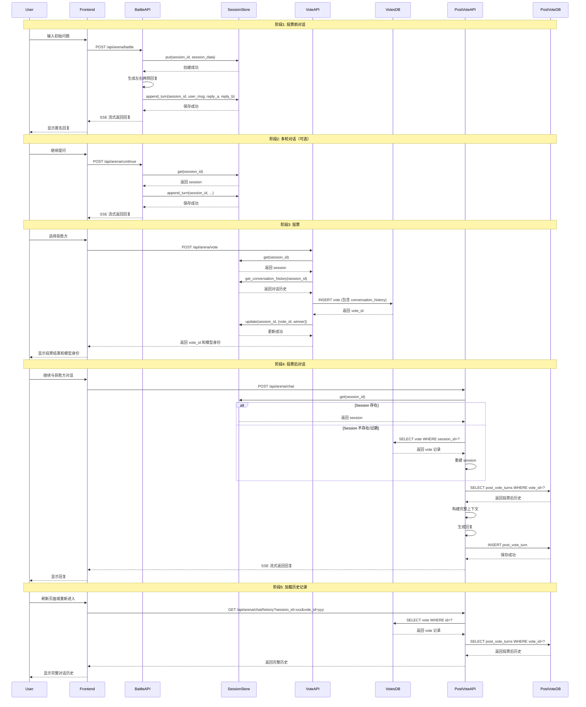
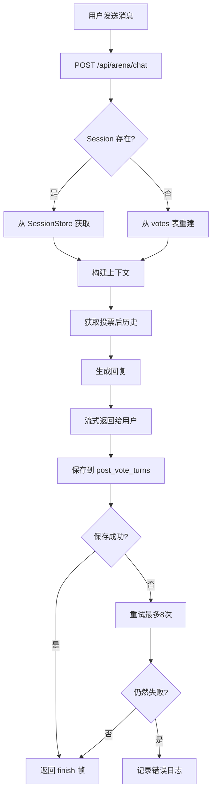
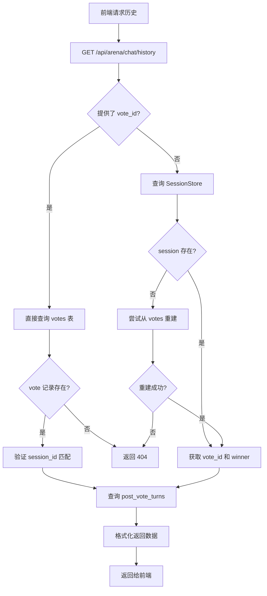

# eChat Arena 投票流程与投票后对话逻辑分析

## 执行摘要

本文档详细分析了 eChat Arena 项目的投票流程和投票后对话逻辑，包括完整的时序图、状态变化、消息保存机制和历史记录加载流程，以及可能导致投票后对话丢失的潜在问题点。

---

## 1. 投票相关路由和端点

### 1.1 主要端点列表

| 端点 | 文件 | 功能 |
|------|------|------|
| `POST /api/arena/battle` | [arena/routes/battle.py](arena/routes/battle.py#L38) | 开始新的 A/B 对话 |
| `POST /api/arena/continue` | [arena/routes/battle.py](arena/routes/battle.py#L127) | 投票前的多轮对话续写 |
| `POST /api/arena/vote` | [arena/routes/vote.py](arena/routes/vote.py#L28) | 提交投票 |
| `POST /api/arena/chat` | [arena/routes/chat.py](arena/routes/chat.py#L28) | 投票后继续对话 |
| `GET /api/arena/chat/history` | [arena/routes/chat.py](arena/routes/chat.py#L127) | 获取投票后对话历史 |

### 1.2 数据库表结构

#### votes 表
```sql
-- 主要字段
- id: UUID (主键)
- session_id: UUID (唯一约束)
- conversation_history: JSONB (投票前对话历史)
- turn_count: INTEGER (投票前轮数)
- user_vote: TEXT (投票结果)
- model_config: JSONB (模型配置)
- reply_a, reply_b: TEXT (模型回复)
- winner_type: TEXT (baseline/strategy/tie/both_bad)
```

#### post_vote_turns 表
```sql
-- 主要字段
- id: UUID (主键)
- vote_id: UUID (关联 votes.id)
- winner_side: TEXT (left/right)
- turn_index: INTEGER (轮次索引，从1开始)
- user_message: TEXT (用户消息)
- assistant_message: TEXT (助手回复)
- UNIQUE(vote_id, turn_index) -- 防止重复
```

#### arena_sessions 表
```sql
-- 主要字段
- session_id: UUID (主键)
- session_data: JSONB (完整 session 数据)
- version: INTEGER (CAS 版本号)
- expires_at: TIMESTAMPTZ (过期时间)
- deleted_at: TIMESTAMPTZ (软删除标记)
```

---

## 2. 投票流程完整时序图



---

## 3. 投票后 Session 状态变化

### 3.1 投票前 Session 结构

```python
{
    "session_id": "uuid",
    "prompt": "用户初始问题",
    "left": {
        "arm": "baseline" | "empathy",
        "model_id": "gpt-4",
        "text": "左侧回复",
        "context": [
            {"role": "system", "content": "..."},
            {"role": "user", "content": "..."},
            {"role": "assistant", "content": "..."}
        ]
    },
    "right": {
        "arm": "baseline" | "empathy",
        "model_id": "gpt-4",
        "text": "右侧回复",
        "context": [...]
    },
    "conversation_history": [
        {
            "turn": 1,
            "user": "用户消息",
            "reply_a": "左侧回复",
            "reply_b": "右侧回复",
            "timestamp": "2026-01-01T00:00:00Z"
        }
    ],
    "turn_count": 1,
    "emotion": "sad",
    "intensity": "high",
    "support_type": "both",
    "template_id": "template_1",
    "strategy_name": "empathy_strategy",
    "version": 1,
    "created_at": "2026-01-01T00:00:00Z"
}
```

### 3.2 投票后 Session 结构

```python
{
    # ... 原有字段 ...
    "vote_id": "uuid",  # 新增：投票记录 ID
    "winner": "left" | "right",  # 新增：获胜方
    "ai_scores": {  # 新增：AI 评估分数
        "model_a": 0.85,
        "model_b": 0.72
    }
}
```

### 3.3 Session 状态转换

```
[初始状态] → [多轮对话] → [投票] → [投票后对话]
    ↓            ↓           ↓          ↓
  创建        append_turn   update     继续使用
  session     更新历史     添加       vote_id
              和 context   vote_id    和 winner
```

### 3.4 Session 过期机制

**TTL 配置：**
- 默认 TTL：`_SESSION_TTL_SEC`（从 config.py 读取）
- 缓存 TTL：`_SESSION_CACHE_TTL_SEC`

**过期检查：**
```python
# arena/session/supabase.py: _is_expired()
def _is_expired(self, session_data: Dict[str, Any]) -> bool:
    expires_at_str = session_data.get("expires_at")
    if not expires_at_str:
        return False
    try:
        expires_at = datetime.fromisoformat(expires_at_str.replace("Z", "+00:00"))
        return datetime.now(expires_at.tzinfo) >= expires_at
    except (ValueError, TypeError):
        return False
```

**过期后的处理：**
- Session 从 arena_sessions 表中软删除（deleted_at 设置为当前时间）
- 但 votes 表中的数据永久保存
- 投票后对话历史保存在 post_vote_turns 表中

---

## 4. 投票后对话消息保存逻辑

### 4.1 保存流程



### 4.2 保存代码分析

**关键函数：** `_insert_post_vote_turn_supabase`

**位置：** [arena/db/post_vote.py](arena/db/post_vote.py#L18)

**代码逻辑：**
```python
async def _insert_post_vote_turn_supabase(
    vote_id: str,
    winner_side: str,
    turn_index: int,
    user_message: str,
    assistant_message: str,
    user_id: Optional[str] = None,
) -> str:
    """插入投票后对话轮次到 Supabase

    返回值：
        "ok" | "conflict" | "error"
    """
    # 1. 检查配置
    if not SUPABASE_URL or not SUPABASE_SERVICE_KEY:
        return "error"

    # 2. 准备数据
    row = {
        "vote_id": vote_id,
        "user_id": user_id,
        "winner_side": winner_side,
        "turn_index": turn_index,
        "user_message": user_message,
        "assistant_message": assistant_message,
    }

    # 3. 发送 POST 请求
    resp = await _http_post_json_with_retries(client, url, headers, row, timeout=REQUEST_TIMEOUT)

    # 4. 处理响应
    if resp.status_code >= 400:
        if _looks_like_unique_violation(resp):
            return "conflict"  # UNIQUE(vote_id, turn_index) 冲突
        return "error"
    return "ok"
```

### 4.3 并发控制机制

**重试逻辑：** [arena/services/chat.py](arena/services/chat.py#L238)

```python
MAX_TURN_INDEX_RETRIES = 8
saved_turn_index: Optional[int] = None

for i in range(MAX_TURN_INDEX_RETRIES):
    candidate = base_turn_index + i
    status = await _insert_post_vote_turn_supabase(
        vote_id=vote_id,
        winner_side=winner_side,
        turn_index=candidate,
        user_message=user_message,
        assistant_message=assistant_text,
        user_id=user_id,
    )
    if status == "ok":
        saved_turn_index = candidate
        break
    if status == "conflict":
        await asyncio.sleep(0.05 + random.random() * 0.05)
        continue
    break
```

**并发冲突处理：**
- 使用 UNIQUE(vote_id, turn_index) 约束防止重复
- 冲突时自动递增 turn_index 重试
- 最多重试 8 次
- 每次重试之间有随机延迟（50-100ms）

---

## 5. 历史记录加载完整流程

### 5.1 加载流程图



### 5.2 加载代码分析

**关键函数：** `get_post_vote_chat_history`

**位置：** [arena/routes/chat.py](arena/routes/chat.py#L127)

**代码逻辑：**
```python
@router.get(f"{API_PREFIX}/chat/history")
async def get_post_vote_chat_history(session_id: str, vote_id: str = "") -> JSONResponse:
    """获取投票后对话历史"""

    # 路径1: vote_id 直接查询
    if vote_id:
        # 1. 获取 vote 记录
        vote_record = await _fetch_vote_record(vote_id)
        if not vote_record:
            return _history_error("not found", status=404)

        # 2. 验证 session_id 匹配
        vote_session_id = str(vote_record.get("session_id") or "")
        if vote_session_id != session_id:
            return _history_error("not found", status=404)

        # 3. 获取投票后历史
        turns, fetch_error = await _fetch_post_vote_turns_supabase(vote_id)

        # 4. 格式化返回
        formatted_turns = [
            {
                "turn_index": turn.get("turn_index"),
                "user_message": turn.get("user_message"),
                "assistant_message": turn.get("assistant_message"),
                "created_at": turn.get("created_at")
            }
            for turn in turns
        ]

        # 5. 确定 winner
        winner = _determine_winner(vote_record)

        return _history_response({
            "type": "history",
            "vote_id": vote_id,
            "winner": winner,
            "turns": formatted_turns,
            "conversation": {
                "prompt": vote_record.get("prompt"),
                "reply_a": vote_record.get("reply_a"),
                "reply_b": vote_record.get("reply_b"),
                "conversation_history": vote_record.get("conversation_history", []),
                "model_config": vote_record.get("model_config"),
            }
        })

    # 路径2: session_id 查询
    sess = await get_state().session_store.get(session_id)
    if not sess:
        sess = await _reconstruct_session_from_votes(session_id)
        if not sess:
            return _history_error("session not found or expired", status=404)

    vote_id = sess.get("vote_id")
    winner = sess.get("winner")

    if not vote_id:
        return _history_response({
            "vote_id": None,
            "winner": winner,
            "turns": []
        })

    # 获取投票后历史
    turns, fetch_error = await _fetch_post_vote_turns_supabase(vote_id)
    # ... 格式化返回
```

### 5.3 上下文构建逻辑

**关键函数：** `build_post_vote_context`

**位置：** [arena/services/chat.py](arena/services/chat.py#L28)

**代码逻辑：**
```python
async def build_post_vote_context(
    sess: Dict[str, Any],
    session_id: str,
    user_message: str,
) -> Dict[str, Any]:
    """构建投票后对话上下文"""

    # 1. 获取投票前历史
    if sess.get("_reconstructed"):
        pre_vote_history = sess.get("conversation_history", [])
    else:
        pre_vote_history = await get_state().session_store.get_conversation_history(session_id)

    # 2. 获取投票后历史（有超时限制）
    post_vote_turns: List[Dict[str, Any]] = []
    try:
        fetch_timeout_sec = float(os.environ.get("ARENA_POST_VOTE_HISTORY_TIMEOUT_SEC", "5"))
        post_vote_turns, _fetch_err = await asyncio.wait_for(
            _fetch_post_vote_turns_supabase(vote_id),
            timeout=fetch_timeout_sec,
        )
    except Exception as exc:
        log_error("post_vote_turns_fetch_timeout_or_error", ...)
        post_vote_turns = []

    # 3. 合并历史用于情感分类
    combined_history = []
    for turn in pre_vote_history:
        combined_history.append({
            "user": turn.get("user", ""),
            "reply_a": turn.get("reply_a", ""),
            "reply_b": turn.get("reply_b", "")
        })
    for turn in post_vote_turns:
        assistant_msg = turn.get("assistant_message", "")
        combined_history.append({
            "user": turn.get("user_message", ""),
            "reply_a": assistant_msg,
            "reply_b": assistant_msg
        })

    # 4. 重新分类情感
    classifier = await asyncio.wait_for(
        _classify_emotion(user_message, conversation_history=combined_history),
        timeout=classify_timeout_sec,
    )

    # 5. 构建消息列表
    messages: List[Dict[str, str]] = [{"role": "system", "content": system_prompt}]

    # 添加投票前历史（只保留获胜方回复）
    for turn in pre_vote_history:
        user_msg = turn.get("user", "")
        if winner_side == "left":
            assistant_msg = turn.get("reply_a", "")
        else:
            assistant_msg = turn.get("reply_b", "")
        messages.append({"role": "user", "content": user_msg})
        messages.append({"role": "assistant", "content": assistant_msg})

    # 添加投票后历史
    for turn in post_vote_turns:
        messages.append({"role": "user", "content": turn.get("user_message", "")})
        messages.append({"role": "assistant", "content": turn.get("assistant_message", "")})

    # 添加当前用户消息
    messages.append({"role": "user", "content": user_message})

    # 6. Token 管理（截断超长上下文）
    MAX_CONTEXT_TOKENS = 4096
    RESERVED_TOKENS = 1000
    total_tokens = sum(_count_tokens(msg["content"]) for msg in messages)

    while total_tokens > (MAX_CONTEXT_TOKENS - RESERVED_TOKENS) and len(messages) > 2:
        messages.pop(1)
        if len(messages) > 1 and messages[1]["role"] == "assistant":
            messages.pop(1)
        total_tokens = sum(_count_tokens(msg["content"]) for msg in messages)

    return {
        "winner_side": winner_side,
        "winner_model_id": winner_model_id,
        "vote_id": vote_id,
        "messages": messages,
        "emo": emo,
        "inten": inten,
        "stype": stype,
        "comment": comment,
        "post_vote_turns": post_vote_turns,
        "total_tokens": total_tokens,
        "user_id": sess.get("user_id"),
    }
```

---

## 6. 可能导致投票后对话丢失的代码位置

### 6.1 Session 过期问题

**位置：** [arena/session/supabase.py](arena/session/supabase.py#L95)

**问题描述：**
- Session 有 TTL 限制，过期后从 arena_sessions 表中软删除
- 如果前端只保存了 session_id 而没有保存 vote_id，重建 session 时会丢失投票后对话

**代码片段：**
```python
def _is_expired(self, session_data: Dict[str, Any]) -> bool:
    expires_at_str = session_data.get("expires_at")
    if not expires_at_str:
        return False
    try:
        expires_at = datetime.fromisoformat(expires_at_str.replace("Z", "+00:00"))
        return datetime.now(expires_at.tzinfo) >= expires_at
    except (ValueError, TypeError):
        return False
```

**影响范围：**
- 用户关闭浏览器后重新打开
- Session TTL 过期
- 前端没有持久化 vote_id

**建议修复：**
- 前端应该持久化 vote_id（localStorage 或 URL 参数）
- 历史加载接口优先使用 vote_id 而不是 session_id

---

### 6.2 Session 重建逻辑不完整

**位置：** [arena/services/reconstruction.py](arena/services/reconstruction.py#L10)

**问题描述：**
- `_reconstruct_session_from_votes` 只重建基本字段
- 不包含 post_vote_turns 数据
- 重建的 session 无法用于继续投票后对话

**代码片段：**
```python
async def _reconstruct_session_from_votes(session_id: str) -> Optional[Dict[str, Any]]:
    """从 votes 表重建 session，支持永久对话。"""
    # ... 查询 votes 表 ...

    return {
        "session_id": session_id,
        "vote_id": str(vote.get("id")),
        "winner": winner,
        "user_id": vote.get("user_id"),
        "left": {...},
        "right": {...},
        "conversation_history": vote.get("conversation_history", []),
        "last_template_id": model_config.get("template_id") or vote.get("template_id"),
        "last_strategy_name": model_config.get("strategy_name") or vote.get("strategy_name"),
        "_reconstructed": True,
        # 缺少：post_vote_turns 数据
    }
```

**影响范围：**
- Session 过期后重建
- 无法加载投票后对话历史
- 无法继续投票后对话

**建议修复：**
- 重建时同时查询 post_vote_turns
- 或者重建后立即从数据库加载投票后历史

---

### 6.3 历史加载依赖 vote_id

**位置：** [arena/routes/chat.py](arena/routes/chat.py#L127)

**问题描述：**
- `get_post_vote_chat_history` 如果没有 vote_id，只能从 session 获取
- 如果 session 不存在且没有 vote_id，无法加载历史

**代码片段：**
```python
@router.get(f"{API_PREFIX}/chat/history")
async def get_post_vote_chat_history(session_id: str, vote_id: str = "") -> JSONResponse:
    # ... vote_id 路径 ...

    # Fallback: session-based lookup
    sess = await get_state().session_store.get(session_id)
    if not sess:
        sess = await _reconstruct_session_from_votes(session_id)
        if not sess:
            return _history_error("session not found or expired", status=404)

    vote_id = sess.get("vote_id")
    winner = sess.get("winner")

    if not vote_id:
        return _history_response({
            "vote_id": None,
            "winner": winner,
            "turns": []  # 无法加载投票后历史
        })
```

**影响范围：**
- 前端没有保存 vote_id
- Session 过期且重建失败
- 投票后对话历史丢失

**建议修复：**
- 前端必须持久化 vote_id
- 或者提供通过 session_id 直接查询 votes 表的接口

---

### 6.4 并发写入失败

**位置：** [arena/db/post_vote.py](arena/db/post_vote.py#L18)

**问题描述：**
- `_insert_post_vote_turn_supabase` 可能因为网络错误、数据库错误等失败
- 虽然有重试机制，但最多重试 8 次
- 如果所有重试都失败，投票后对话会丢失

**代码片段：**
```python
async def _insert_post_vote_turn_supabase(...) -> str:
    try:
        async with httpx.AsyncClient() as client:
            resp = await _http_post_json_with_retries(client, url, headers, row, timeout=REQUEST_TIMEOUT)
            if resp.status_code >= 400:
                if _looks_like_unique_violation(resp):
                    return "conflict"
                log_error("post_vote_turn_insert_failed", ...)
                return "error"
            return "ok"
    except Exception as exc:
        log_error("post_vote_turn_insert_exception", ...)
        return "error"
```

**影响范围：**
- 网络不稳定
- 数据库连接问题
- Supabase 服务不可用
- 投票后对话消息丢失

**建议修复：**
- 增加重试次数
- 实现本地缓存，失败后重试
- 添加离线队列，恢复后重试

---

### 6.5 投票后历史获取超时

**位置：** [arena/services/chat.py](arena/services/chat.py#L68)

**问题描述：**
- `build_post_vote_context` 获取 post_vote_turns 时有 5 秒超时
- 超时后 post_vote_turns 为空列表
- 导致上下文不完整，但不会阻止对话

**代码片段：**
```python
try:
    fetch_timeout_sec = float(os.environ.get("ARENA_POST_VOTE_HISTORY_TIMEOUT_SEC", "5"))
    post_vote_turns, _fetch_err = await asyncio.wait_for(
        _fetch_post_vote_turns_supabase(vote_id),
        timeout=fetch_timeout_sec,
    )
except Exception as exc:
    log_error("post_vote_turns_fetch_timeout_or_error", ...)
    post_vote_turns = []  # 超时后为空
```

**影响范围：**
- 数据库响应慢
- 网络延迟高
- 上下文不完整，但对话可以继续
- 历史记录可能不完整

**建议修复：**
- 增加超时时间
- 或者异步加载历史，不阻塞对话

---

### 6.6 前端未持久化 vote_id

**位置：** 前端代码（未在本次分析范围内）

**问题描述：**
- 如果前端只保存 session_id 而没有保存 vote_id
- Session 过期后无法重建
- 投票后对话历史丢失

**建议修复：**
- 前端应该持久化 vote_id（localStorage 或 URL 参数）
- 历史加载接口优先使用 vote_id
- 提供 vote_id 查询接口

---

## 7. 总结与建议

### 7.1 关键发现

1. **投票后对话存储在独立表**：`post_vote_turns` 表与 `votes` 表分离，避免污染实验数据

2. **Session 有 TTL 限制**：Session 会过期，但 votes 和 post_vote_turns 数据永久保存

3. **重建逻辑不完整**：`_reconstruct_session_from_votes` 不包含 post_vote_turns 数据

4. **依赖 vote_id**：加载投票后历史必须要有 vote_id

5. **并发控制完善**：使用 UNIQUE 约束和重试机制处理并发冲突

### 7.2 优先级建议

**高优先级：**
1. 前端必须持久化 vote_id（localStorage 或 URL 参数）
2. 修复 `_reconstruct_session_from_votes`，包含 post_vote_turns 数据
3. 历史加载接口优先使用 vote_id

**中优先级：**
4. 增加投票后历史获取超时时间
5. 增加并发写入重试次数
6. 实现本地缓存和离线队列

**低优先级：**
7. 添加监控和告警
8. 优化数据库查询性能
9. 实现数据备份和恢复

### 7.3 测试建议

1. **Session 过期测试**：模拟 Session 过期后重建
2. **并发写入测试**：模拟多个请求同时写入
3. **网络故障测试**：模拟网络不稳定情况
4. **历史加载测试**：测试各种边界情况

---

## 8. 附录

### 8.1 相关文件清单

| 文件 | 功能 |
|------|------|
| [arena/routes/vote.py](arena/routes/vote.py) | 投票端点 |
| [arena/routes/battle.py](arena/routes/battle.py) | 对话端点 |
| [arena/routes/chat.py](arena/routes/chat.py) | 投票后对话端点 |
| [arena/services/chat.py](arena/services/chat.py) | 投票后对话服务 |
| [arena/db/post_vote.py](arena/db/post_vote.py) | 投票后对话数据库操作 |
| [arena/db/votes.py](arena/db/votes.py) | 投票数据库操作 |
| [arena/session/supabase.py](arena/session/supabase.py) | Session 存储 |
| [arena/services/reconstruction.py](arena/services/reconstruction.py) | Session 重建 |
| [arena/services/battle.py](arena/services/battle.py) | 对话服务 |

### 8.2 数据库迁移文件

| 文件 | 功能 |
|------|------|
| [migrations/add_post_vote_chat.sql](migrations/add_post_vote_chat.sql) | 创建 post_vote_turns 表 |
| [migrations/add_conversation_history.sql](migrations/add_conversation_history.sql) | 添加 conversation_history 字段 |

### 8.3 环境变量

| 变量 | 默认值 | 说明 |
|------|--------|------|
| `ARENA_POST_VOTE_HISTORY_TIMEOUT_SEC` | 5 | 投票后历史获取超时时间（秒） |
| `ARENA_POST_VOTE_CLASSIFY_TIMEOUT_SEC` | 12 | 投票后情感分类超时时间（秒） |
| `_SESSION_TTL_SEC` | - | Session TTL（秒） |
| `_SESSION_CACHE_TTL_SEC` | - | Session 缓存 TTL（秒） |

---

**文档版本：** 1.0
**生成日期：** 2026-02-11
**作者：** GitHub Copilot
