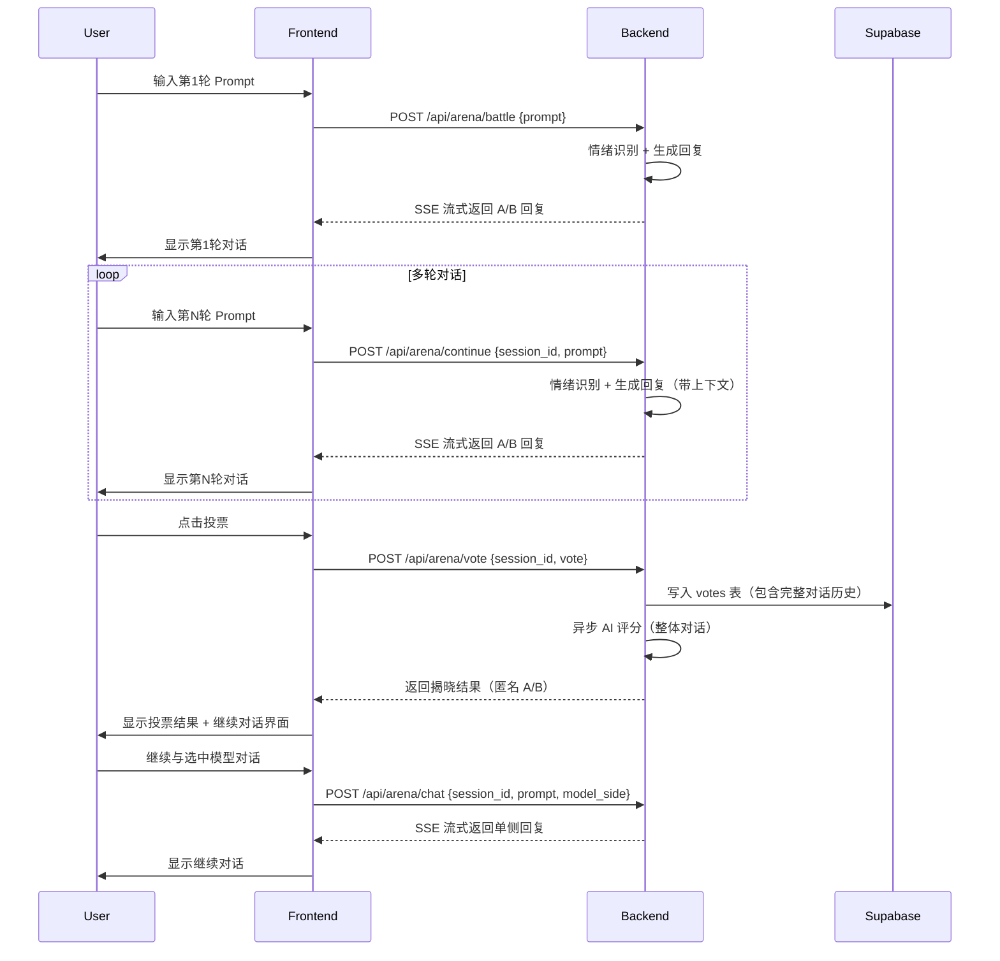
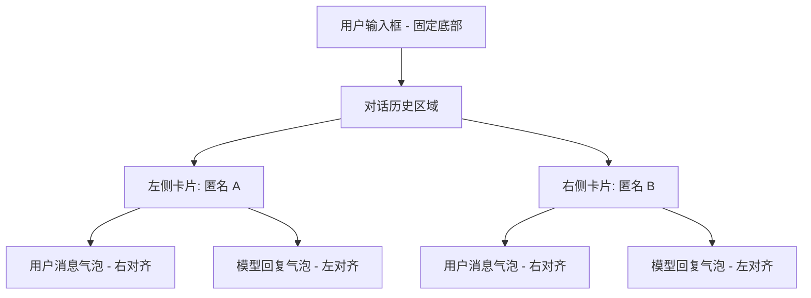
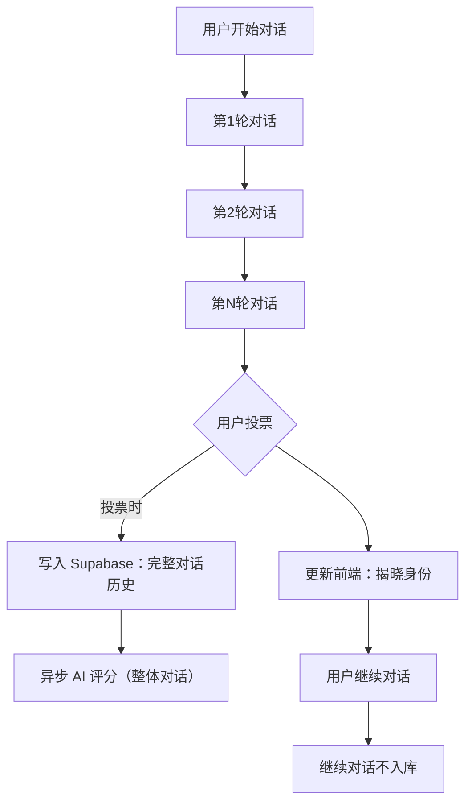
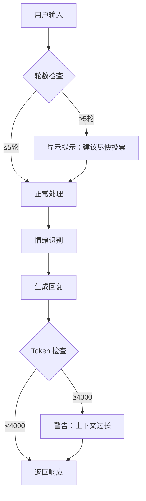

# Model Arena 多轮对话功能规格

## 1. 概述

本文档定义了 Model Arena 增强版的多轮对话功能设计。该功能允许用户与两个模型（Baseline vs Strategy）进行连续交互，投票后可继续与选中的模型对话，同时保持实验的双盲性和数据完整性。

### 1.1 核心目标

- **增强用户体验**：允许用户进行多轮深度对话，更接近真实咨询场景
- **保持双盲性**：用户在投票前后都不会知道具体哪个是 Strategy 模型
- **数据完整性**：完整记录每轮对话历史，用于后续分析
- **成本控制**：通过软限制和优化设计控制 API 成本

### 1.2 关键特性

- 多轮连续对话（投票前：A/B 并行，投票后：单侧继续）
- 每轮独立情绪识别与策略调整
- 后端 SessionStore 管理对话状态
- 单次投票时机（用户自主决定何时投票）
- 双盲性保持（用户只看到匿名 A/B，不揭晓具体策略）

## 2. 技术架构设计

### 2.1 整体流程



### 2.2 状态管理

#### 2.2.1 后端 SessionStore

使用现有的 `SessionStore` 类管理多轮对话状态：

```python
# 存储结构
{
    "session_id": "abc123",
    "created_at": "2026-01-17T14:00:00Z",
    "_ts": 1705490400.0,
    "status": "ongoing",  # ongoing | voted | finished
    "turns": [
        {
            "turn": 1,
            "user_prompt": "我最近压力很大",
            "emotion": "anxiety",
            "intensity": "medium",
            "support_type": "both",
            "classifier_comment": "用户表达压力和焦虑",
            "template_id": "empathy_anxiety_medium",
            "strategy_name": "共情焦虑中度",
            "model_a": {
                "arm": "baseline",
                "model_id": "gpt-4",
                "text": "我理解你的感受..."
            },
            "model_b": {
                "arm": "strategy",
                "model_id": "gpt-4",
                "text": "听起来你最近承受了很多压力..."
            }
        },
        {
            "turn": 2,
            "user_prompt": "是的，特别是工作方面",
            "emotion": "anxiety",
            "intensity": "high",
            "support_type": "emotional",
            "classifier_comment": "焦虑加重，更具体",
            "template_id": "empathy_anxiety_high",
            "strategy_name": "共情焦虑高度",
            "model_a": {...},
            "model_b": {...}
        }
    ],
    "current_turn": 2,
    "base_model_name": "gpt-4",
    "ai_scores": null  # 投票后填充
}
```

#### 2.2.2 数据持久化

**投票时一次性写入 Supabase**：

```sql
ALTER TABLE votes ADD COLUMN conversation_history JSONB;

-- 示例数据结构
{
    "turns": [
        {
            "turn": 1,
            "user_prompt": "我最近压力很大",
            "emotion": "anxiety",
            "intensity": "medium",
            "support_type": "both",
            "template_id": "empathy_anxiety_medium",
            "model_a": {"arm": "baseline", "text": "..."},
            "model_b": {"arm": "strategy", "text": "..."}
        },
        {
            "turn": 2,
            "user_prompt": "是的，特别是工作方面",
            "emotion": "anxiety",
            "intensity": "high",
            "template_id": "empathy_anxiety_high",
            "model_a": {...},
            "model_b": {...}
        }
    ],
    "total_turns": 2,
    "voted_at_turn": 2
}
```

### 2.3 API 接口定义

#### 2.3.1 多轮对话端点

**POST /api/arena/continue**

请求：
```json
{
    "session_id": "abc123",
    "prompt": "是的，特别是工作方面"
}
```

响应（SSE）：
```json
// 首帧：meta 信息
{"side": "meta", "session_id": "abc123", "turn": 2, "emotion": "anxiety", "intensity": "high", "template_id": "empathy_anxiety_high"}

// 流式：model_a 回复
{"side": "left", "delta": "听", "finish": false}
{"side": "left", "delta": "起来", "finish": false}
...
{"side": "left", "finish": true}

// 流式：model_b 回复
{"side": "right", "delta": "我", "finish": false}
{"side": "right", "delta": "感", "finish": false}
...
{"side": "right", "finish": true}
```

#### 2.3.2 投票端点（扩展）

**POST /api/arena/vote**

请求：
```json
{
    "session_id": "abc123",
    "vote": "right",  // 或 "left", "tie", "both_bad"
    "prompt": "我最近压力很大",  // 最新一轮 prompt
    "left_model": "anonymous_a",
    "right_model": "anonymous_b"
}
```

响应：
```json
{
    "ok": true,
    "session_id": "abc123",
    "revealed_left": {"arm": "baseline", "model_id": "gpt-4"},
    "revealed_right": {"arm": "strategy", "model_id": "gpt-4"}
}
```

#### 2.3.3 继续对话端点

**POST /api/arena/chat**

请求：
```json
{
    "session_id": "abc123",
    "prompt": "谢谢你，我感受到了支持",
    "model_side": "right"  // 用户选择的模型
}
```

响应（SSE）：
```json
{"side": "model", "delta": "不", "finish": false}
{"side": "model", "delta": "客", "finish": false}
...
{"side": "model", "finish": true}
```

### 2.4 数据库 Schema 变更

```sql
-- 1. 添加 JSONB 字段存储完整对话历史
ALTER TABLE public.votes 
ADD COLUMN conversation_history JSONB;

-- 2. 添加元数据字段
ALTER TABLE public.votes 
ADD COLUMN total_turns INTEGER,
ADD COLUMN voted_at_turn INTEGER,
ADD COLUMN continued_after_vote BOOLEAN DEFAULT false;

-- 3. 创建索引（可选，取决于查询模式）
CREATE INDEX idx_votes_total_turns ON public.votes(total_turns);
CREATE INDEX idx_votes_voted_at_turn ON public.votes(voted_at_turn);
```

## 3. 前端组件设计

### 3.1 对话界面布局



**UI 状态变化**：

- **投票前**：两侧都活跃，可滚动查看所有轮次
- **投票后**：未选中侧置灰（不可输入），选中侧保持活跃
- **投票后继续**：用户消息显示在两侧（历史），模型回复仅显示在选中侧

### 3.2 组件变更

**BattlePage.tsx**

```typescript
// 新增状态
interface BattleState {
  turns: Array<{
    userPrompt: string;
    leftReply: string;
    rightReply: string;
    emotion?: string;
    intensity?: string;
    templateId?: string;
  }>;
  currentTurn: number;
  voteState: 'unvoted' | 'voted' | 'continued';
  selectedModel?: 'left' | 'right';
}

// 新增方法
const handleContinueConversation = useCallback(async (prompt: string) => {
  if (!voteState.selectedModel) return;
  
  const res = await fetch('/api/proxy/api/arena/chat', {
    method: 'POST',
    body: JSON.stringify({
      session_id: meta.session_id,
      prompt,
      model_side: voteState.selectedModel
    })
  });
  // 处理 SSE 流
}, [voteState.selectedModel, meta.session_id]);
```

**ResponseCard.tsx**

```typescript
// 新增 props
interface ResponseCardProps {
  isActive?: boolean;  // 投票后是否可继续
  isGrayedOut?: boolean;  // 投票后未选中侧置灰
  showTurnNumber?: boolean;  // 显示轮次编号
}
```

## 4. 实验设计考量

### 4.1 双盲性保持

- **投票前**：用户只看到"匿名 A"和"匿名 B"，不知道哪个是 Strategy
- **投票后**：仍然只显示"Reply A"和"Reply B"，用户不知道哪个是 Baseline/Strategy，完全保持双盲性
- **继续对话**：用户只与选中的模型对话（例如 Reply B），未选中侧置灰但不隐藏

### 4.2 数据收集策略



### 4.3 实验变量控制

- **独立变量**：对话轮数（自然变化，不干预）
- **依赖变量**：
  - 用户投票偏好（model_a vs model_b vs tie）
  - AI 评分（empathy/safety/helpfulness）
  - 对话轮数（total_turns）
- **控制变量**：
  - 基础模型一致（Single Model Controlled Variable）
  - 情绪识别算法一致
  - 评分标准一致

## 5. 安全与性能考量

### 5.1 成本控制



### 5.2 安全防护

- **Prompt Injection 防御**：保留现有的 `SYSTEM_SAFETY_OVERRIDE` 和 `BASELINE_SAFETY_OVERRIDE`
- **敏感内容检测**：每轮回复都通过安全过滤器
- **会话过期**：SessionStore 维持 2 小时 TTL（可配置）
- **速率限制**：每用户每分钟最多 5 次请求

### 5.3 性能优化

- **并行生成**：两个模型的回复并行生成（保持当前设计）
- **流式输出**：SSE 流式传输，提升体验
- **缓存优化**：SessionStore 使用异步锁，防止竞态
- **数据库优化**：批量写入（投票时一次性写入完整历史）

## 6. 实施步骤

### 6.1 阶段 1：后端基础功能（1 周）

- [ ] 实现 `/api/arena/continue` 端点
- [ ] 扩展 SessionStore 支持多轮对话
- [ ] 实现多轮情绪识别逻辑
- [ ] 扩展 `/api/arena/vote` 支持 conversation_history
- [ ] 添加数据库字段

### 6.2 阶段 2：前端集成（1.5 周）

- [ ] 修改 BattlePage 支持多轮对话
- [ ] 实现投票后继续对话逻辑
- [ ] 设计轮数提示 UI（软限制提示）
- [ ] 适配移动端布局

### 6.3 阶段 3：测试与优化（0.5 周）

- [ ] 单元测试（后端）
- [ ] 集成测试（前后端联调）
- [ ] 用户测试（真实用户反馈）
- [ ] 性能测试（并发、延迟）

### 6.4 阶段 4：部署与监控（0.5 周）

- [ ] 部署到测试环境
- [ ] 监控 API 成本（token 消耗）
- [ ] 监控用户行为（平均轮数、投票分布）
- [ ] 根据数据调整软限制阈值

## 7. 附录

### 7.1 术语表

- **Baseline**：对照组模型，使用简单的帮助助手 system prompt
- **Strategy**：实验组模型，使用共情策略模板
- **Single Model**：两个模型使用相同的底层模型（仅 system prompt 不同）
- **Turn**：一轮完整的用户输入 + 两个模型回复
- **Session**：从用户开始对话到投票结束的完整周期

### 7.2 核心决策记录

| 决策点 | 选项 | 理由 |
|--------|------|------|
| 数据持久化 | SessionStore + 投票时写库 | 简单快速，符合实验场景 |
| 情绪识别 | 每轮重新识别 | 保持 Strategy 的适应性 |
| AI 评分 | 仅投票时评分整体对话 | 控制成本，更符合实验目的 |
| UI 布局 | 保持左右分栏 | 便于 A/B 对比 |
| 轮数限制 | 软限制（5 轮后提示） | 平衡用户体验与成本 |
| 双盲性 | 完全保持双盲（投票后仍显示 Reply A/B） | 保持实验严谨性 |

### 7.3 未来扩展可能性

- **多模型对比**：支持超过 2 个模型的 A/B/C 测试
- **实时翻译**：支持多语言对话
- **情绪可视化**：将情绪变化以图表形式展示
- **对话评分**：用户可对每轮对话进行微观评分
