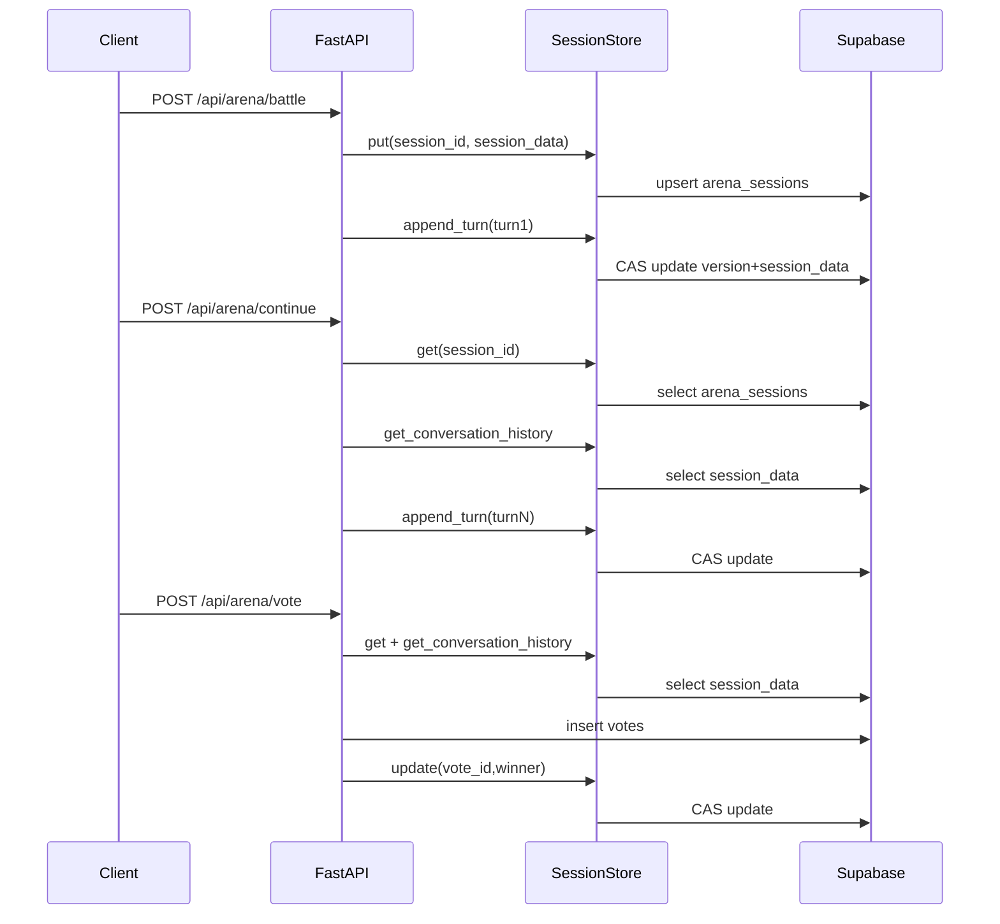

# SessionStore 持久化改造（Supabase）完整设计

> 备注：本文档覆盖：背景、表 Schema SQL、接口改造清单、并发控制方案、性能优化建议、迁移计划、软删除功能、单侧上下文隔离、管理员 API、监控与日志。

> 范围：完整设计文档，包含持久化方案、软删除功能和单侧上下文隔离设计，以及实现代码示例。

## 目录

1. [背景与问题](#1-背景与问题)
2. [现有 SessionStore 接口与实现分析](#2-现有-sessionstore-接口与实现分析)
3. [Supabase 持久化表设计（Schema）](#3-supabase-持久化表设计schema)
4. [数据一致性与并发控制策略](#4-数据一致性与并发控制策略)
5. [性能优化考虑](#5-性能优化考虑)
6. [迁移与兼容性](#6-迁移与兼容性)
7. [接口改造清单](#7-接口改造清单sessionstore--supabasesessionstore)
8. [软删除功能设计](#8-软删除功能设计)
9. [单侧上下文隔离实现](#9-单侧上下文隔离实现)
10. [参考：关键时序图](#10-参考关键时序图简化)
11. [总结与实施计划](#11-总结与实施计划)

## 1. 背景与问题

当前会话状态由内存会话存储 [`SessionStore`](app.py:1244) 承载，数据保存在进程内字典 `self._sessions`（见 [`SessionStore.__init__()`](app.py:1245)）。

该方案在以下场景会丢失状态：

- Heroku / dyno 重启：内存清空
- 多实例部署：请求可能落到不同实例，各自内存不共享

后果是：

- `/api/arena/continue` 在校验会话时读取不到 session，触发 `Invalid session`（见 [`continue_battle()`](app.py:2223) 中对 [`_SESSION_STORE.get()`](app.py:2256) 的校验）。

改造目标：将 SessionStore 从内存字典升级为 Supabase Postgres 持久化存储，以保障跨重启与跨实例可用。

## 2. 现有 SessionStore 接口与实现分析

### 2.1 核心接口（现状）

[`SessionStore`](app.py:1244) 当前提供以下异步方法（均受单实例内的 [`asyncio.Lock`](app.py:1246) 保护）：

- 写入新会话：[`SessionStore.put()`](app.py:1249)
- 读取会话：[`SessionStore.get()`](app.py:1260)
- 局部更新会话：[`SessionStore.update()`](app.py:1270)
- 追加一轮对话：[`SessionStore.append_turn()`](app.py:1280)
- 读取对话历史：[`SessionStore.get_conversation_history()`](app.py:1361)
- 读取轮次计数：[`SessionStore.get_turn_count()`](app.py:1376)

### 2.2 内存实现的关键语义

1) TTL 语义

- 通过会话对象内的 `_ts` 字段保存最后更新时间（`time.time()`），读时判断 `(now - _ts) > _SESSION_TTL_SEC` 即过期并删除（见 [`SessionStore.get()`](app.py:1260)）。
- TTL 秒数由 [`_SESSION_TTL_SEC`](app.py:310) 控制。

2) 容量上限

- 通过 [`_MAX_SESSIONS`](app.py:311) 控制字典大小，超限后在 [`SessionStore._gc_locked()`](app.py:1391) 里按 `_ts` 从旧到新淘汰。

3) append_turn 的一致性策略（单实例）

- 通过 `conversation_history` 数组与 `turn_count` 计数维护多轮上下文（见 [`SessionStore.append_turn()`](app.py:1280)）。
- 用 `version` 字段实现“乐观锁”的版本递增（见 [`SessionStore.append_turn()`](app.py:1309) 到 [`SessionStore.append_turn()`](app.py:1346)），但由于整体仍在同一把进程内锁下执行，实质上不会出现并发写冲突；该 `version` 更像是为未来分布式存储预留。

4) 数据形态

在 [`_battle_sse()`](app.py:1926) 中创建 session 时写入的核心字段包括：

- `session_id`、`prompt`
- `left` / `right`：包含 `arm`、`model_id`、`text`
- 情绪分类结果：`emotion`、`intensity`、`support_type`、`classifier_comment`
- 策略元数据：`template_id`、`strategy_name`、以及后续 turn 的 `last_template_id`、`last_strategy_name`
- `ai_scores`（异步回填）
- `created_at`

写入发生在 [`_SESSION_STORE.put()`](app.py:2078)。首轮对话历史追加发生在 [`_SESSION_STORE.append_turn()`](app.py:2103)。

### 2.3 调用链路与关键业务场景

#### A) battle：创建 session + 写入首轮

入口：[`battle()`](app.py:2186) → 流式生成：[`_battle_sse()`](app.py:1926)

关键读写：

- 创建 session：[`_SESSION_STORE.put()`](app.py:2078)
- 追加首轮 turn：[`_SESSION_STORE.append_turn()`](app.py:2103)
- 后台评分回填：[`_SESSION_STORE.update()`](app.py:2110)

#### B) continue：读取 session + 读取历史 + 追加 turn + 更新元数据

入口：[`continue_battle()`](app.py:2223)

关键读写：

- 校验 session 存在且未投票：[`_SESSION_STORE.get()`](app.py:2256)
- 读取轮次用于提示与 soft warning：[`_SESSION_STORE.get_turn_count()`](app.py:2265)
- 读取历史用于上下文分类与生成：[`_SESSION_STORE.get_conversation_history()`](app.py:2279)
- 生成前先写入本轮策略元数据，保证 vote 端读取到最新值：[`_SESSION_STORE.update()`](app.py:2315)
- 生成后追加 turn（带重试）：[`_SESSION_STORE.append_turn()`](app.py:2527)
- 生成后更新 session 的情绪与策略元数据：[`_SESSION_STORE.update()`](app.py:2550)

#### C) vote：读取 session + 读取历史/轮次 + 写 votes + 回写 vote_id

入口：[`vote()`](app.py:2616)

关键读写：

- 读取 session：[`_SESSION_STORE.get()`](app.py:2633)
- 读取历史与轮次并写入 `votes.conversation_history` 与 `votes.turn_count`：[`_SESSION_STORE.get_conversation_history()`](app.py:2649)、[`_SESSION_STORE.get_turn_count()`](app.py:2650)
  - 相关 DB 字段迁移见 [`migrations/add_conversation_history.sql`](migrations/add_conversation_history.sql:1)
- 投票写入 Supabase `votes` 后，将 `vote_id` 与 `winner` 回写 session：[`_SESSION_STORE.update()`](app.py:2815)

#### D) post_vote_chat：读取 session + 依赖 vote_id + 读取 pre-vote 历史

入口：[`post_vote_chat()`](app.py:2886)

关键读写：

- 读取 session：[`_SESSION_STORE.get()`](app.py:2925)
- 依赖 `vote_id`：当 `vote_id` 缺失时直接报错（见 [`post_vote_chat()`](app.py:2934) 到 [`post_vote_chat()`](app.py:2938)）
- 读取 pre-vote 历史用于构建上下文：[`_SESSION_STORE.get_conversation_history()`](app.py:2953)
- 每轮更新 `last_template_id/last_strategy_name`：[`_SESSION_STORE.update()`](app.py:3050)

#### E) chat history：读取 session 决定是否可查

入口：[`get_post_vote_chat_history()`](app.py:3253)

- 读取 session：[`_SESSION_STORE.get()`](app.py:3285)

### 2.4 小结：SessionStore 必须持久化的字段集合

为避免重启/多实例导致 `Invalid session`，至少需要持久化以下信息（与现有 `sess` dict 对齐）：

- session 基础：`session_id`、`prompt`、`created_at`
- 生成结果（投票前）：`left`、`right`
- 多轮对话：`conversation_history`、`turn_count`、`version`
- 投票相关：`winner`、`vote_id`（供 [`post_vote_chat()`](app.py:2886) 使用）
- 策略元数据：`template_id`、`strategy_name`、`last_template_id`、`last_strategy_name`
- TTL：最后活跃时间（当前通过 `_ts`），持久化后应使用 `expires_at`

## 3. Supabase 持久化表设计（Schema）

### 3.1 表设计目标

- 单表存储完整 session 状态，保证一次读即可恢复继续对话、投票与投票后聊天所需信息。
- 支持 TTL 回收，避免无限增长。
- 支持并发更新（尤其是 [`SessionStore.append_turn()`](app.py:1280)）。
- **新增**：支持软删除功能，允许用户删除聊天记录但保留数据可恢复。
- **新增**：支持单侧上下文隔离，确保每个模型只能看到自己的对话历史。

### 3.2 主表：arena_sessions

> 表名要求：`arena_sessions`

#### 3.2.1 建议字段

- `session_id`：主键，建议使用 `TEXT`（原因：当前默认 session id 来源为 `uuid.uuid4().hex`，非标准连字符 UUID；见 [`battle()`](app.py:2186) 内 `uuid.uuid4().hex` 生成逻辑）。
- `session_data`：`JSONB`，存储完整状态（与当前内存 `sess` dict 结构一致）。
- `expires_at`：`TIMESTAMPTZ`，用于 TTL。
- `created_at` / `updated_at`：审计字段。
- **新增**：`deleted_at`：`TIMESTAMPTZ`，用于软删除功能。

#### 3.2.2 并发控制辅助字段（强烈建议）

尽管需求只列出必需字段，但为在 DB 层实现真正的乐观锁，建议额外增加：

- `version`：`BIGINT NOT NULL DEFAULT 0`

理由：

- 直接在 `WHERE session_id = ? AND version = ?` 条件下更新，最可靠、成本最低。
- 若把 `version` 放在 `session_data` JSONB 内，表达式比较与自增更复杂，且难以在后续扩展中复用。

#### 3.2.3 Schema SQL（建议稿）

```sql
-- 1) 会话主表
CREATE TABLE IF NOT EXISTS arena_sessions (
  session_id  TEXT PRIMARY KEY,
  session_data JSONB NOT NULL DEFAULT '{}'::jsonb,

  -- 乐观锁版本号（建议）
  version     BIGINT NOT NULL DEFAULT 0,

  -- TTL
  expires_at  TIMESTAMPTZ NOT NULL,

  -- 软删除
  deleted_at  TIMESTAMPTZ,

  created_at  TIMESTAMPTZ NOT NULL DEFAULT NOW(),
  updated_at  TIMESTAMPTZ NOT NULL DEFAULT NOW()
);

-- 2) 必要索引：TTL 清理/查询
CREATE INDEX IF NOT EXISTS idx_arena_sessions_expires_at
  ON arena_sessions (expires_at);

-- 3) 软删除索引
CREATE INDEX IF NOT EXISTS idx_arena_sessions_deleted_at
  ON arena_sessions (deleted_at);

-- 4) 可选：updated_at 自动维护
-- 说明：Supabase 常见做法是使用 trigger 维护 updated_at；也可由应用层在每次写入时设置。
```

### 3.3 单侧上下文隔离数据结构

为实现单侧上下文隔离，`session_data` 中的数据结构需要扩展以支持每个模型独立的上下文：

```json
{
  "session_id": "abc123",
  "prompt": "用户提示",
  "left": {
    "arm": "left",
    "model_id": "model_a",
    "text": "模型A的回复",
    "context": [
      {"role": "user", "content": "用户消息1"},
      {"role": "assistant", "content": "模型A的回复1"}
    ]
  },
  "right": {
    "arm": "right", 
    "model_id": "model_b",
    "text": "模型B的回复",
    "context": [
      {"role": "user", "content": "用户消息1"},
      {"role": "assistant", "content": "模型B的回复1"}
    ]
  },
  "conversation_history": [
    // 完整对话历史，用于投票和审计
    {
      "turn": 1,
      "user_msg": "用户消息1",
      "reply_a": "模型A的回复1",
      "reply_b": "模型B的回复1",
      "timestamp": "2023-01-01T00:00:00Z"
    }
  ],
  "turn_count": 1,
  "version": 1,
  "created_at": "2023-01-01T00:00:00Z"
}
```

**关键设计点**：
- 每个模型（left/right）有独立的 `context` 数组，仅包含该模型可见的对话历史
- `conversation_history` 保留完整对话历史，用于投票和审计目的
- 上下文构建时，每个模型只能看到自己的 `context`，不能看到对方的回复

### 3.3 索引策略

必需索引：

- 主键已保证 `session_id` 唯一（满足“session_id 唯一索引”要求）。
- `expires_at` B-Tree 索引（满足“过期清理索引”要求）。

可选索引（按需求增量启用）：

- `vote_id` 快速定位：若需要基于 `vote_id` 找回 `session_id`（当前代码不需要），可增加表达式索引，例如 `((session_data->>'vote_id'))`。
- JSONB GIN：仅在确实需要对 `session_data` 内部字段做过滤检索时考虑。当前主要按 `session_id` 点查，GIN 索引通常性价比不高。

### 3.4 conversation_history 的存储策略取舍

现状：投票写入 `votes` 表时，会把多轮历史持久化到 `votes.conversation_history`（见 [`vote()`](app.py:2616) 写入 row 字段，以及迁移脚本 [`migrations/add_conversation_history.sql`](migrations/add_conversation_history.sql:1)）。

但在投票前，`/api/arena/continue` 与 `/api/arena/chat` 需要随时读取历史，因此不能依赖 `votes.conversation_history`。

方案比较：

1) 方案 A（推荐）：`conversation_history` 放在 `arena_sessions.session_data`

- 优点：单表单行即可恢复全部状态；接口迁移最小。
- 缺点：每次追加 turn 需要更新 JSONB（但 turn 数通常很少，且会话 TTL 较短，可接受）。

2) 方案 B：`conversation_history` 单独列（JSONB 数组）+ `session_data` 保留其它字段

- 优点：更清晰的更新路径，可只更新历史列。
- 缺点：数据存在“重复来源”，需要定义权威来源（session_data vs 独立列）；设计与实现复杂度上升。

结论：推荐方案 A，后续如出现性能瓶颈再引入方案 B 或拆分表。

---

## 4. 数据一致性与并发控制策略

### 4.1 并发风险与一致性目标

把 session 状态从单进程内存迁移到 Supabase（多实例共享 DB）后，真实并发写会出现，主要来源：

- 用户多标签页 / 双击触发同一 `session_id` 的并发 `/api/arena/continue`（两次都尝试 `append_turn`）
- `continue` 与后台任务并发写同一 session
  - 例如 [`_bg_eval()`](app.py:2106) 对 [`_SESSION_STORE.update()`](app.py:2110) 写入 `ai_scores`
- `/api/arena/vote` 写回 `vote_id/winner` 与同一时刻的 `continue` 更新策略元数据（见 [`continue_battle()`](app.py:2223) 的 [`_SESSION_STORE.update()`](app.py:2315) 与 [`vote()`](app.py:2616) 的 [`_SESSION_STORE.update()`](app.py:2815)）

一致性目标（按重要性排序）：

1. 不丢 turn（append_turn 的写入不可被覆盖）
2. `turn_count` 与 `conversation_history` 保持一致（或可修复）
3. 多个并发 patch（如 `vote_id`、`ai_scores`、`last_template_id`）不互相覆盖
4. API 语义尽可能保持与内存版一致（如 missing session 时返回 None / 空数组 / 0）

### 4.2 数据不变量（Invariants）

在持久化版中建议维持以下不变量（用于检测与修复）：

- `turn_count == len(conversation_history)`
- `conversation_history[i].turn == i+1`（从 1 开始连续）
- `session_data.session_id`（若保留）与行主键 `session_id` 一致

这些不变量与内存版 [`SessionStore.append_turn()`](app.py:1280) 的一致性检查与 auto-repair 思路一致（见其对 `history_length != turn_count` 的修复逻辑）。

### 4.3 并发控制：推荐使用 DB 乐观锁（version）

#### 4.3.1 为什么必须用 version

内存版通过进程内 [`asyncio.Lock`](app.py:1246) 串行化写入；多实例后该锁不再提供全局互斥。

因此持久化版需要在 DB 层引入“比较并交换（CAS）”语义：

- 读出 `version`
- 基于该版本构造新 `session_data`
- 仅当 DB 中 `version` 仍等于旧值时才允许写入

这可以避免“后写覆盖先写”的丢失更新（lost update）。

#### 4.3.2 用 updated_at 做乐观锁的替代方案（不推荐）

也可用 `updated_at` 当作版本比较字段，但存在：

- 时间戳精度/时钟差异的边界问题
- 同一毫秒多次写入的不可区分性（尤其在高并发/批处理）

因此推荐使用 [`arena_sessions`](plans/sessionstore_supabase_design.md:160) 的 `version BIGINT`。

### 4.4 Supabase（PostgREST）下的实现形态

当前项目对 Supabase 的交互采用 REST + `httpx`（例如 [`_insert_vote_supabase()`](app.py:1477)）。SessionStore 持久化也建议复用同一路径。

关键能力映射：

- `put()`：使用 upsert
  - PostgREST 语义上等价于 `INSERT ... ON CONFLICT(session_id) DO UPDATE ...`
  - 用于 battle 创建 session（见 [`_SESSION_STORE.put()`](app.py:2078)）
- `update()` / `append_turn()`：使用“带过滤条件的 PATCH”实现 CAS
  - 通过 `?session_id=eq.X&version=eq.OLD` 过滤
  - 若返回 0 行更新 => 冲突，需要重试

### 4.5 append_turn 的乐观锁方案（核心）

#### 4.5.1 设计原则

- append_turn 必须是“读-改-写 + 版本比较”的原子意图
- 若冲突（version 不匹配），返回 False 让上层重试
  - 现有 `/api/arena/continue` 已包含 append_turn 重试逻辑（见 [`continue_battle()`](app.py:2223) 中 `MAX_APPEND_RETRIES` 循环，以及对 [`_SESSION_STORE.append_turn()`](app.py:2527) 的调用）

#### 4.5.2 建议流程（概念步骤）

1. `SELECT`：读取 `session_data, version, expires_at`
2. 过期判断：若 `expires_at <= now()` 视为不存在（返回 False / None）
3. 基于不变量修复：若 `turn_count != len(history)`，以 `len(history)` 作为权威进行修复（与内存版一致）
4. 生成 `turn_record`：`turn = turn_count + 1`，并写入 `timestamp`
5. 构造新 `session_data`：
   - `conversation_history = history + [turn_record]`
   - `turn_count = turn`
   - （可选）同步 `session_data.version = version+1` 仅用于 debug；权威仍以列 `version` 为准
6. CAS 更新：仅当 `version` 未变化时写入
   - 同时更新：`version = old_version + 1`、`updated_at = now()`、`expires_at = now() + TTL`
7. 若 CAS 失败：返回 False（由上层重试，或 SessionStore 内部自己重试）

#### 4.5.3 冲突与重试策略

- 建议重试次数：与现有 `continue` 保持一致（例如 3 次）
- 每次重试都必须重新读取最新 `session_data`，再追加（避免覆盖其他写入）
- 冲突后可选的“去重检查”（防重复 turn）：
  - 若发现 `conversation_history` 已存在相同 `turn` 且内容一致（例如同一 `user_msg`），可将其视为幂等成功
  - 否则继续按最新状态追加下一轮

> 注：当前 API 未携带 request_id，因此“严格幂等”无法完全保证；上述去重仅作为尽力而为。

### 4.6 update()/put() 的一致性策略

#### 4.6.1 update()（patch merge）

[`SessionStore.update()`](app.py:1270) 在内存中是 `dict.update()` 语义。持久化版建议保持：

- 读取当前 `session_data`
- 在应用层做深/浅合并（至少要覆盖顶层 key）
- 使用 CAS 写回（同样依赖 `version`）

目的：避免并发 patch 互相覆盖。

#### 4.6.2 put()（upsert 语义）

[`SessionStore.put()`](app.py:1249) 内存版会直接覆盖同名 key。持久化版建议：

- 使用 upsert 覆盖 `session_data`
- 同时重置（或初始化）`conversation_history=[]`、`turn_count=0`（与内存版初始化逻辑一致）
- 初始化 `expires_at = now() + TTL`

是否允许覆盖“已存在且未过期”的 session_id：

- 为保持当前行为，默认允许覆盖
- 作为安全增强，可在未来增加配置：若已存在且未过期，则拒绝覆盖并返回错误（防止 session_id 冲突）

### 4.7 是否需要分布式锁（Redis）

结论：一般不需要。

原因：

- 所有写冲突都集中在单行（`session_id`）上
- Postgres 的单行更新 + CAS 条件足以提供线性化的“单 key 互斥更新”效果

何时考虑 Redis/分布式锁：

- 将来 session 变为跨多表、多行更新且需要跨资源一致性
- 或者要实现严格的 per-session 排队（例如必须保持请求顺序）

现阶段建议保持架构简单，仅依赖 DB 事务语义 + 乐观锁。

---

## 5. 性能优化考虑

### 5.1 读写负载特征（按接口）

- `/api/arena/battle`：写（创建 session）+ 写（首轮 [`SessionStore.append_turn()`](app.py:1280)）
  - 创建见 [`_SESSION_STORE.put()`](app.py:2078)
  - 首轮追加见 [`_SESSION_STORE.append_turn()`](app.py:2103)
- `/api/arena/continue`：读（校验 session）+ 读（history）+ 写（策略元数据）+ 写（append_turn）+ 写（情绪/策略回填）
  - 校验读见 [`_SESSION_STORE.get()`](app.py:2256)
  - history 读见 [`_SESSION_STORE.get_conversation_history()`](app.py:2279)
  - 生成前写见 [`_SESSION_STORE.update()`](app.py:2315)
  - 生成后追加见 [`_SESSION_STORE.append_turn()`](app.py:2527)
- `/api/arena/vote`：读（session）+ 读（history/turn_count）+ 写（votes 表）+ 写（回写 vote_id/winner）
  - 读见 [`_SESSION_STORE.get()`](app.py:2633)
  - 回写见 [`_SESSION_STORE.update()`](app.py:2815)

因此性能优化主线是：减少 `/continue` 的多次 DB 往返、控制 `session_data` 体积增长、提供可预测的 TTL 回收。

### 5.2 TTL 自动清理策略

持久化后会话过期不再由 [`SessionStore._gc_locked()`](app.py:1391) 在请求路径中执行，而应转为 DB 侧 / 定时任务侧清理。

#### 5.2.1 首选：pg_cron（DB 内定时清理）

如果 Supabase 项目启用了 `pg_cron` 扩展，可采用周期任务：

- `DELETE FROM arena_sessions WHERE expires_at < now();`

优点：

- 清理在 DB 内完成，不占用应用实例资源
- 多实例下不会重复清理

注意点：

- 删除频率不必过高；会话过期属于最终一致即可
- 大表场景可分批删除，避免长事务

#### 5.2.2 备选：外部定时器（推荐顺位 2）

若 `pg_cron` 不可用，可用外部调度触发清理 SQL（同样执行上述删除语句）：

- GitHub Actions（cron）
- Cloud Scheduler（HTTP → Supabase SQL endpoint / edge function）
- Supabase Scheduled Functions（如已启用）

#### 5.2.3 备选：应用内后台任务（最后兜底）

复用现有“启动时注册定时任务”的模式（见 [`_startup()`](app.py:2136) 中对 APScheduler 的使用），周期性调用 Supabase 清理。

风险：

- 多实例下会重复清理（通常无害但增加 DB 压力）
- dyno 重启会影响调度稳定性

### 5.3 请求路径上的 TTL 续期（Sliding TTL）

内存版 TTL 通过 `_ts` 在 [`SessionStore.update()`](app.py:1276) 与 [`SessionStore.append_turn()`](app.py:1346) 中更新。

持久化版建议：

- 在每次成功写入（put/update/append_turn）时，把 `expires_at` 更新为 `now() + ARENA_SESSION_TTL_SEC`
- 对纯读（get/get_conversation_history/get_turn_count）是否续期：
  - 默认不续期（避免被探测流量无限延长会话寿命）
  - 如产品需要“读也续期”，应仅对可信用户请求续期

### 5.4 减少 DB 往返

#### 5.4.1 “一次读，多次用”

`/api/arena/continue` 当前逻辑先 [`_SESSION_STORE.get()`](app.py:2256) 再 [`_SESSION_STORE.get_conversation_history()`](app.py:2279)。持久化版可以：

- `get()` 直接返回完整 `session_data`，并在同一请求内复用其中的 `conversation_history/turn_count`
- 避免在同一请求中重复查询 DB

#### 5.4.2 patch 写入最小化

`continue` 的“策略元数据预写”（见 [`_SESSION_STORE.update()`](app.py:2315)）是必要的一致性手段，但应：

- 仅写入 `last_template_id/last_strategy_name` + TTL 续期
- 避免无谓重写大体积 JSON

### 5.5 缓存层建议（可选）

#### 5.5.1 本地 LRU + Supabase 作为权威源

可引入“每实例本地 LRU”作为读优化：

- Key：`session_id`
- Value：`session_data + version + expires_at`
- TTL：短（例如 10–60 秒），写成功后更新缓存

一致性：

- 写必须走 DB CAS（见第 4 章）
- CAS 冲突必须回源 DB

注意：对 `/vote`、`post_vote_chat` 等强一致读取建议强制回源 DB（避免读到缺失 `vote_id/winner` 的旧缓存）。

#### 5.5.2 Redis（暂不需要）

若未来 DB 读压过高再考虑 Redis 共享缓存；当前阶段建议保持架构简单。

### 5.6 JSONB 索引与数据体积控制

#### 5.6.1 JSONB 索引

访问模式以 `session_id` 点查为主，因此：

- 不建议默认建立 `session_data` 的 GIN 索引
- 仅在确实需要按 JSON 字段过滤时，再增量加“表达式索引”
  - 例如对 `vote_id` 检索可对 `session_data->>'vote_id'` 建索引（当前代码不需要）

#### 5.6.2 控制 session_data 增长

`conversation_history` 每轮会增加 `user/reply_a/reply_b`，回复文本可能较长。

建议：

- 保持/强化轮次限制策略（现有 soft warning 见 [`continue_battle()`](app.py:2223) → [`_SESSION_STORE.get_turn_count()`](app.py:2265)）
- 可选：对 `conversation_history` 做“最近 N 轮截断”
  - 代价：影响情绪分类与生成上下文质量（参见 [`continue_battle()`](app.py:2223) 的 token 截断逻辑）

## 6. 迁移与兼容性

### 6.1 旧内存 session 的处理策略

结论：默认不迁移，要求用户重新发起 battle。

理由：

- 旧内存 session 仅存在于单个 dyno/实例内，且在重启时已不可恢复；不存在可靠的“批量导出源”。
- 强行做迁移需要在“切换到 Supabase 前”提前把所有内存 session 扫描写入 DB；但多实例/滚动发布时很难保证覆盖。
- 会话数据本质是短生命周期（受 [`_SESSION_TTL_SEC`](app.py:310) 控制），重新发起 battle 的用户体验成本可接受。

产品提示建议：

- 对 `Invalid session` 的错误信息可在前端提示“会话已过期或服务已重启，请重新开始对话”。

### 6.2 是否保留内存 fallback（降级策略）

需要区分两类故障：

- 配置缺失：未设置 `SUPABASE_URL/SUPABASE_SERVICE_KEY`
- 运行时故障：Supabase 网络错误、超时、5xx

推荐策略：

1) 配置缺失：直接回退到 memory（开发/本地环境友好）
2) 运行时故障：不建议透明回退到 memory

理由：

- 若运行时故障时回退到 memory，会导致同一 `session_id` 的状态分裂（部分请求读写到 DB，部分读写到内存），造成更难排查的一致性问题。

折中方案（可选）：

- “只读降级”：当 DB 不可用时，`get()` 可尝试从本地 LRU 读取最近缓存并继续服务只读接口；但写接口（update/append_turn/put）仍返回错误。

### 6.3 配置开关：ARENA_SESSION_STORE

建议引入环境变量：

- `ARENA_SESSION_STORE=memory|supabase`

行为定义：

- `memory`：保持现状（使用 [`SessionStore`](app.py:1244) 的内存实现）。
- `supabase`：使用 Supabase 持久化实现（同名接口）。

默认值建议：

- 生产环境：`supabase`
- 本地/测试环境：`memory` 或 `supabase`（取决于是否提供 Supabase 凭证）

### 6.4 灰度与回滚策略

建议发布顺序：

1. 先上线“可配置的 store 工厂”，但默认仍使用 memory
2. 在生产环境创建 `arena_sessions` 表并验证权限
3. 小流量/单实例启用 `ARENA_SESSION_STORE=supabase`，观察错误率与延迟
4. 全量启用 supabase

回滚：

- 若 Supabase 会话存储出现故障，可将 `ARENA_SESSION_STORE` 切回 `memory`
- 代价：切回后现有 DB session 将不会被读取（用户需要重新 battle），但可快速恢复服务可用性

### 6.5 安全与权限（RLS）注意事项

当前后端对 Supabase 使用 service role（见 [`SUPABASE_SERVICE_KEY`](app.py:52)），因此默认绕过 RLS。

建议：

- `arena_sessions` 仅供后端服务访问，不对客户端暴露。
- 若未来需要客户端直连读取（不建议），必须设计 RLS：至少按 `session_id` / `user_id` 绑定并验证访问。

## 7. 接口改造清单（SessionStore → SupabaseSessionStore）

> 目标：对上层业务代码（如 [`continue_battle()`](app.py:2223)、[`vote()`](app.py:2616)、[`post_vote_chat()`](app.py:2886)）保持同一组接口与返回语义，替换底层存储实现。

### 7.1 通用规则（所有方法）

- 会话不存在或已过期：
  - [`SessionStore.get()`](app.py:1260) 返回 `None`
  - [`SessionStore.get_conversation_history()`](app.py:1361) 返回 `[]`
  - [`SessionStore.get_turn_count()`](app.py:1376) 返回 `0`
  - [`SessionStore.update()`](app.py:1270) 静默返回（与内存版一致）
  - [`SessionStore.append_turn()`](app.py:1280) 返回 `False`
- 每次成功写入（put/update/append_turn）：续期 `expires_at = now() + TTL`（见第 5.3 节）
- 并发写：统一使用 `version` CAS（见第 4 章）

### 7.2 [`SessionStore.put()`](app.py:1249)

现状语义：

- 初始化 `conversation_history=[]`、`turn_count=0`（若不存在）
- 覆盖写入 `self._sessions[session_id] = value`

持久化改造：

- Upsert `arena_sessions`：
  - `session_data = value`（确保包含 `conversation_history/turn_count`）
  - `version = 0`（或使用 DB 默认）
  - `expires_at = now() + TTL`

注意：如果 `session_id` 重复，upsert 会覆盖旧会话；这与内存版“覆盖写”一致。

### 7.3 [`SessionStore.get()`](app.py:1260)

现状语义：

- 找不到返回 `None`
- 过期则删除并返回 `None`
- 否则返回 dict

持久化改造：

- `SELECT session_data, version, expires_at`
- 若 `expires_at <= now()`：返回 `None`（可选：异步触发删除）
- 返回 `session_data`（`version` 建议仅内部持有，不暴露给上层）

### 7.4 [`SessionStore.update()`](app.py:1270)

现状语义：

- 会话不存在：直接返回
- 否则 `item.update(patch)` 并更新时间戳 `_ts`

持久化改造：

- 读取当前 `session_data` + `version`
- 合并 patch：至少对顶层 key 做覆盖合并（`dict.update` 语义）
- CAS 写回：`WHERE session_id = ? AND version = old_version`
- 冲突：内部可重试有限次；若仍失败，记录日志并返回（上层通常不依赖 update 的强一致结果）

### 7.5 [`SessionStore.append_turn()`](app.py:1280)

现状语义：

- 会话不存在：返回 False
- 在单进程锁内追加 turn，并递增 `turn_count/version/_ts`

持久化改造：

- 采用第 4.5 节的 CAS 追加方案
- 冲突：返回 False
  - 上层 [`continue_battle()`](app.py:2223) 已实现重试

### 7.6 [`SessionStore.get_conversation_history()`](app.py:1361)

现状语义：

- 会话不存在：返回 `[]`
- 否则返回 `item.get('conversation_history', [])`

持久化改造：

- `SELECT session_data`
- 返回 `session_data.conversation_history` 或 `[]`

### 7.7 [`SessionStore.get_turn_count()`](app.py:1376)

现状语义：

- 会话不存在：返回 `0`
- 否则返回 `item.get('turn_count', 0)`

持久化改造：

- `SELECT session_data`
- 返回 `session_data.turn_count` 或 `0`

---

## 8. 软删除功能设计

### 8.1 需求与目标

- 允许用户删除聊天记录但保留数据可恢复
- 避免物理删除导致的数据永久丢失
- 提供管理员接口用于会话管理和统计
- 保持现有接口兼容性

### 8.2 实现方案

#### 8.2.1 数据库层面

- 添加 `deleted_at` 字段（`TIMESTAMPTZ`）用于标记软删除时间
- 软删除操作：更新 `deleted_at = NOW()` 而不是物理删除
- 恢复操作：将 `deleted_at` 设置为 `NULL`
- 所有读取操作默认过滤 `deleted_at IS NULL` 的记录

#### 8.2.2 新增接口

```python
# 软删除接口
async def soft_delete(session_id: str) -> bool:
    """软删除会话 - 标记为已删除但不实际删除数据"""
    url = f"{SUPABASE_URL}/rest/v1/arena_sessions?session_id=eq.{session_id}"
    headers = {
        "apikey": SUPABASE_SERVICE_KEY,
        "Authorization": f"Bearer {SUPABASE_SERVICE_KEY}",
        "Content-Type": "application/json",
        "Prefer": "return=minimal"
    }
    async with httpx.AsyncClient() as client:
        try:
            resp = await client.patch(
                url,
                headers=headers,
                json={"deleted_at": _utc_now_iso()},
                timeout=REQUEST_TIMEOUT
            )
            return resp.status_code < 400
        except Exception as exc:
            log_error("session_soft_delete_failed", {
                "session_id": session_id,
                "error": str(exc)
            }, exc)
            return False

# 恢复接口
async def restore_session(session_id: str) -> bool:
    """恢复被软删除的会话"""
    url = f"{SUPABASE_URL}/rest/v1/arena_sessions?session_id=eq.{session_id}"
    headers = {
        "apikey": SUPABASE_SERVICE_KEY,
        "Authorization": f"Bearer {SUPABASE_SERVICE_KEY}",
        "Content-Type": "application/json",
        "Prefer": "return=minimal"
    }
    async with httpx.AsyncClient() as client:
        try:
            resp = await client.patch(
                url,
                headers=headers,
                json={"deleted_at": None},
                timeout=REQUEST_TIMEOUT
            )
            return resp.status_code < 400
        except Exception as exc:
            log_error("session_restore_failed", {
                "session_id": session_id,
                "error": str(exc)
            }, exc)
            return False

# 清理已删除会话接口
async def cleanup_deleted_sessions(max_age_days: int = 30) -> int:
    """物理删除超过指定天数的软删除会话"""
    cutoff = (datetime.now() - timedelta(days=max_age_days)).isoformat()
    url = f"{SUPABASE_URL}/rest/v1/arena_sessions"
    headers = {
        "apikey": SUPABASE_SERVICE_KEY,
        "Authorization": f"Bearer {SUPABASE_SERVICE_KEY}",
        "Content-Type": "application/json",
        "Prefer": "return=minimal"
    }
    
    # 先查询符合条件的会话
    query_url = f"{url}?deleted_at=lt.{cutoff}"
    async with httpx.AsyncClient() as client:
        try:
            # 查询符合条件的会话
            resp = await client.get(query_url, headers=headers, timeout=REQUEST_TIMEOUT)
            if resp.status_code >= 400:
                return 0
            
            sessions = resp.json()
            if not sessions:
                return 0
            
            # 批量删除
            session_ids = [s["session_id"] for s in sessions]
            delete_resp = await client.delete(
                f"{url}?session_id=in.({','.join(session_ids)})",
                headers=headers,
                timeout=REQUEST_TIMEOUT
            )
            return len(session_ids) if delete_resp.status_code < 400 else 0
        except Exception as exc:
            log_error("cleanup_deleted_sessions_failed", {
                "max_age_days": max_age_days,
                "error": str(exc)
            }, exc)
            return 0
```

### 8.3 管理员 API 端点

#### 8.3.1 会话列表与统计

```python
@app.post("/api/arena/sessions/list")
async def list_sessions(
    page: int = 1,
    page_size: int = 50,
    include_deleted: bool = False,
    admin_key: str = Header(None)
):
    """管理员接口：列表会话与统计"""
    if admin_key != ADMIN_API_KEY:
        raise HTTPException(status_code=403, detail="Unauthorized")
    
    url = f"{SUPABASE_URL}/rest/v1/arena_sessions"
    headers = {
        "apikey": SUPABASE_SERVICE_KEY,
        "Authorization": f"Bearer {SUPABASE_SERVICE_KEY}",
        "Content-Type": "application/json"
    }
    
    # 构建查询条件
    query_params = {
        "select": "session_id,created_at,updated_at,expires_at,deleted_at,session_data->>turn_count",
        "order": "created_at.desc"
    }
    
    if not include_deleted:
        query_params["deleted_at"] = "is.null"
    
    # 分页
    offset = (page - 1) * page_size
    query_params["limit"] = page_size
    query_params["offset"] = offset
    
    # 统计总数
    count_url = f"{url}?select=count"
    if not include_deleted:
        count_url += "&deleted_at=is.null"
    
    async with httpx.AsyncClient() as client:
        try:
            # 获取总数
            count_resp = await client.get(count_url, headers=headers, timeout=REQUEST_TIMEOUT)
            total_count = count_resp.json()[0]["count"] if count_resp.status_code < 400 else 0
            
            # 获取列表
            query_str = "&".join([f"{k}={v}" for k, v in query_params.items()])
            list_resp = await client.get(f"{url}?{query_str}", headers=headers, timeout=REQUEST_TIMEOUT)
            
            if list_resp.status_code >= 400:
                return {
                    "success": False,
                    "error": "Failed to fetch sessions",
                    "total": total_count,
                    "page": page,
                    "page_size": page_size,
                    "sessions": []
                }
            
            sessions = list_resp.json()
            return {
                "success": True,
                "total": total_count,
                "page": page,
                "page_size": page_size,
                "sessions": sessions
            }
        except Exception as exc:
            log_error("list_sessions_failed", {"error": str(exc)}, exc)
            return {
                "success": False,
                "error": str(exc),
                "total": 0,
                "page": page,
                "page_size": page_size,
                "sessions": []
            }
```

#### 8.3.2 会话软删除与恢复

```python
@app.post("/api/arena/session/delete")
async def api_soft_delete_session(
    session_id: str,
    admin_key: str = Header(None)
):
    """管理员接口：软删除会话"""
    if admin_key != ADMIN_API_KEY:
        raise HTTPException(status_code=403, detail="Unauthorized")
    
    success = await soft_delete(session_id)
    if not success:
        raise HTTPException(status_code=500, detail="Failed to soft delete session")
    
    return {"success": True, "session_id": session_id}

@app.post("/api/arena/session/restore")
async def api_restore_session(
    session_id: str,
    admin_key: str = Header(None)
):
    """管理员接口：恢复被软删除的会话"""
    if admin_key != ADMIN_API_KEY:
        raise HTTPException(status_code=403, detail="Unauthorized")
    
    success = await restore_session(session_id)
    if not success:
        raise HTTPException(status_code=500, detail="Failed to restore session")
    
    return {"success": True, "session_id": session_id}
```

### 8.4 监控与日志

#### 8.4.1 关键指标

- `session_soft_delete_count`: 软删除操作次数
- `session_restore_count`: 恢复操作次数  
- `session_cleanup_count`: 清理操作处理的会话数
- `session_cleanup_deleted_count`: 清理操作实际删除的会话数

#### 8.4.2 日志记录

```python
def log_session_operation(operation: str, session_id: str, success: bool, details: dict = None):
    """记录会话操作日志"""
    log_data = {
        "operation": operation,
        "session_id": session_id,
        "success": success,
        "timestamp": datetime.now().isoformat(),
        "details": details or {}
    }
    
    # 记录到日志系统
    logger.info(f"Session {operation}", extra=log_data)
    
    # 可选：写入专用日志表
    # await _log_to_audit_table(log_data)
```

### 8.5 定时任务

```python
# 在 _startup() 中添加定时任务
scheduler.add_job(
    cleanup_deleted_sessions,
    'interval',
    days=1,
    args=[30],  # 清理超过30天的软删除会话
    id='cleanup_deleted_sessions'
)

scheduler.add_job(
    log_session_stats,
    'interval',
    hours=1,
    id='log_session_stats'
)
```

## 9. 单侧上下文隔离实现

### 9.1 需求与目标

- 确保每个模型只能看到自己的对话历史
- 保留完整对话历史用于投票和审计
- 维护现有接口兼容性
- 支持多轮对话的上下文构建

### 9.2 数据结构扩展

在 `session_data` 中为每个模型添加独立的 `context` 字段：

```json
{
  "left": {
    "arm": "left",
    "model_id": "model_a", 
    "text": "模型A的回复",
    "context": [
      {"role": "user", "content": "用户消息1"},
      {"role": "assistant", "content": "模型A的回复1"}
    ]
  },
  "right": {
    "arm": "right",
    "model_id": "model_b",
    "text": "模型B的回复", 
    "context": [
      {"role": "user", "content": "用户消息1"},
      {"role": "assistant", "content": "模型B的回复1"}
    ]
  }
}
```

### 9.3 核心方法实现

#### 9.3.1 上下文构建方法

```python
async def _build_side_context(self, session_data: dict, side: str) -> list:
    """
    构建单侧上下文
    
    Args:
        session_data: 完整会话数据
        side: 'left' 或 'right'
        
    Returns:
        该侧模型可见的上下文消息列表
    """
    if side not in ['left', 'right']:
        raise ValueError(f"Invalid side: {side}")
    
    side_data = session_data.get(side, {})
    context = side_data.get('context', [])
    
    # 确保上下文格式正确
    if not isinstance(context, list):
        context = []
    
    return context
```

#### 9.3.2 追加轮次方法（修改版）

```python
async def append_turn(self, session_id: str, turn_data: dict) -> bool:
    """
    追加一轮对话，支持单侧上下文隔离
    
    Args:
        session_id: 会话ID
        turn_data: 包含 user_msg, reply_a, reply_b 等
        
    Returns:
        是否成功
    """
    max_retries = 3
    
    for attempt in range(max_retries):
        # 1. 读取当前会话
        session = await self.get(session_id)
        if session is None:
            return False
        
        # 2. 构建新的上下文
        user_msg = turn_data['user_msg']
        reply_a = turn_data.get('reply_a', '')
        reply_b = turn_data.get('reply_b', '')
        
        # 更新每个模型的独立上下文
        left_context = await self._build_side_context(session, 'left')
        right_context = await self._build_side_context(session, 'right')
        
        # 添加用户消息到两侧上下文
        left_context.append({"role": "user", "content": user_msg})
        right_context.append({"role": "user", "content": user_msg})
        
        # 添加各自的回复
        if reply_a:
            left_context.append({"role": "assistant", "content": reply_a})
        if reply_b:
            right_context.append({"role": "assistant", "content": reply_b})
        
        # 3. 更新会话数据
        new_session_data = {
            **session,
            'left': {
                **session.get('left', {}),
                'context': left_context
            },
            'right': {
                **session.get('right', {}),
                'context': right_context
            },
            'turn_count': session.get('turn_count', 0) + 1,
            'version': session.get('version', 0) + 1
        }
        
        # 4. 追加到完整对话历史（保持现有逻辑）
        conversation_history = session.get('conversation_history', [])
        turn_num = len(conversation_history) + 1
        
        turn_record = {
            'turn': turn_num,
            'user_msg': user_msg,
            'reply_a': reply_a,
            'reply_b': reply_b,
            'timestamp': datetime.now().isoformat()
        }
        
        conversation_history.append(turn_record)
        new_session_data['conversation_history'] = conversation_history
        
        # 5. CAS 更新
        success = await self._cas_update(session_id, session['version'], new_session_data)
        
        if success:
            return True
        
        # 6. 冲突重试
        if attempt < max_retries - 1:
            await asyncio.sleep(0.1 * (attempt + 1))
    
    return False
```

### 9.4 上下文使用示例

#### 9.4.1 Battle 流程修改

```python
# 在 _battle_sse 中初始化上下文
session_data = {
    'session_id': session_id,
    'prompt': prompt,
    'left': {
        'arm': 'left',
        'model_id': left_model_id,
        'context': [{"role": "system", "content": "You are model A"}]
    },
    'right': {
        'arm': 'right',
        'model_id': right_model_id,
        'context': [{"role": "system", "content": "You are model B"}]
    },
    'conversation_history': [],
    'turn_count': 0,
    'version': 0,
    'created_at': datetime.now().isoformat()
}
```

#### 9.4.2 Continue 流程修改

```python
# 在 continue_battle 中构建模型输入
left_context = await _SESSION_STORE._build_side_context(session, 'left')
right_context = await _SESSION_STORE._build_side_context(session, 'right')

# 为每个模型构建独立的输入
left_input = {
    'messages': left_context + [{"role": "user", "content": user_msg}]
}

right_input = {
    'messages': right_context + [{"role": "user", "content": user_msg}]
}
```

### 9.5 兼容性考虑

#### 9.5.1 现有接口兼容性

- `get_conversation_history()`：返回完整对话历史（不变）
- `get_turn_count()`：返回总轮次数（不变）
- `get()`：返回完整会话数据，包含新的 context 字段
- `update()`：正常工作，但需要注意不覆盖 context 字段

#### 9.5.2 迁移策略

1. **向后兼容**：新字段为可选，旧代码可以正常工作
2. **渐进迁移**：
   - 首先部署支持新数据结构的代码
   - 然后逐步更新 battle/continue 流程使用新的上下文构建逻辑
   - 最后清理旧的上下文构建代码

3. **数据迁移**：
   - 对于现有会话，可以在首次访问时自动初始化 context 字段
   - 或者运行一次性迁移脚本

## 10. 参考：关键时序图（简化）



## 11. 总结与实施计划

### 11.1 核心设计总结

本文档提出了完整的 SessionStore 持久化解决方案，包含三大核心功能：

1. **持久化存储**：使用 Supabase 解决 Heroku dyno 重启和多实例部署导致的会话丢失问题
2. **软删除功能**：允许用户删除聊天记录但保留数据可恢复，提供完整的管理员接口
3. **单侧上下文隔离**：确保每个模型只能看到自己的对话历史，同时保留完整对话历史用于投票

### 11.2 技术架构

- **存储后端**：Supabase Postgres
- **表设计**：单表 `arena_sessions` 存储所有会话数据
- **并发控制**：乐观锁（version 字段）+ CAS 操作
- **数据结构**：每侧模型独立 context 数组 + 完整 conversation_history
- **软删除**：deleted_at 字段标记，支持恢复和定时清理

### 11.3 接口兼容性

- 所有现有接口保持向后兼容
- 新增管理员 API 端点用于会话管理
- 提供完整的监控指标和日志记录方案

### 11.4 实施步骤

#### 阶段 1：准备工作（1-2 天）
- [ ] 创建 `arena_sessions` 表及索引
- [ ] 设置 Supabase 权限和 API 密钥
- [ ] 配置环境变量（ARENA_SESSION_STORE=supabase）
- [ ] 准备数据库迁移脚本

#### 阶段 2：核心实现（3-5 天）
- [ ] 实现 SupabaseSessionStore 类
- [ ] 实现乐观锁和 CAS 操作
- [ ] 实现软删除功能（soft_delete, restore_session, cleanup_deleted_sessions）
- [ ] 实现单侧上下文隔离（_build_side_context, 修改 append_turn）
- [ ] 更新 battle 和 continue 流程使用新的上下文构建逻辑

#### 阶段 3：管理员接口（1-2 天）
- [ ] 实现会话列表 API（/api/arena/sessions/list）
- [ ] 实现软删除 API（/api/arena/session/delete）
- [ ] 实现恢复 API（/api/arena/session/restore）
- [ ] 实现统计和监控端点

#### 阶段 4：测试与验证（2-3 天）
- [ ] 验证持久化功能（重启后会话保留）
- [ ] 验证多实例一致性
- [ ] 验证软删除和恢复功能
- [ ] 验证单侧上下文隔离（模型只能看到自己的历史）
- [ ] 测试并发场景（多个 continue 请求同时操作同一会话）
- [ ] 验证降级机制（Supabase 失败时的行为）
- [ ] 性能测试（响应时间、吞吐量）

#### 阶段 5：部署与监控（1 天）
- [ ] 灰度发布到生产环境
- [ ] 监控错误率和性能指标
- [ ] 设置告警规则
- [ ] 全量切换到 Supabase 存储

### 11.5 关键成功指标

1. **可用性**：会话持久化成功率 ≥ 99.9%
2. **一致性**：并发操作无数据丢失或覆盖
3. **性能**：平均响应时间增加 ≤ 50ms
4. **可恢复性**：软删除数据恢复成功率 100%
5. **上下文隔离**：模型上下文隔离验证通过率 100%

### 11.6 风险与缓解措施

| 风险 | 可能性 | 影响 | 缓解措施 |
|------|--------|------|----------|
| Supabase 服务中断 | 低 | 高 | 实现降级机制，提供只读缓存支持 |
| 并发冲突导致性能下降 | 中 | 中 | 优化重试策略，限制最大重试次数 |
| 数据迁移问题 | 中 | 高 | 逐步迁移，保持双写期间的数据一致性 |
| 上下文隔离逻辑错误 | 中 | 高 | 完整的单元测试和集成测试覆盖 |
| 软删除数据管理复杂 | 低 | 中 | 自动化清理脚本和监控告警 |

### 11.7 未来扩展方向

1. **高级缓存策略**：引入 Redis 共享缓存层
2. **跨区域复制**：支持多区域部署的数据同步
3. **高级审计功能**：完整的操作日志和变更历史
4. **自动化备份**：定期备份和恢复机制
5. **性能优化**：批量操作和异步写入优化

### 11.8 文档与维护

- 保持本文档与代码同步更新
- 提供详细的 API 文档和使用示例
- 建立运维手册和故障排查指南
- 定期审查和优化设计

**完成时间估计**：7-10 天（取决于团队规模和资源可用性）

**优先级**：高（解决核心会话丢失问题，支持关键业务功能）
